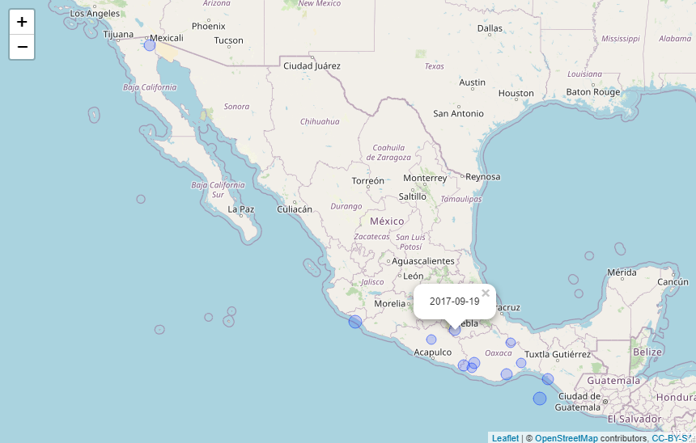
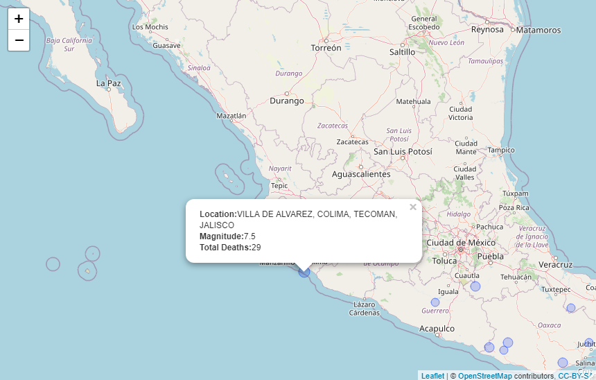

<!-- README.md is generated from README.Rmd. Please edit that file -->

```{r, include = FALSE}
knitr::opts_chunk$set(
  collapse = TRUE,
  message = FALSE,
  warning = FALSE,
  comment = "#>",
  fig.path = "man/figures/README-",
  out.width = "100%"
)
```

# README

<!-- badges: start -->
[](https://travis-ci.com/rsizem2/noaa-earthquakes)
<!-- badges: end -->

This repository contains an R package for working with data from the [NCEI/WDS Global Significant Earthquake Database](https://www.ngdc.noaa.gov/hazel/view/hazards/earthquake/search). This package is a work in progress and not ready for use at the moment.


# Installation

```{r, eval = FALSE}
library(devtools)
install_github("rizem2/noaa-earthquakes")
```

# Example

```{r, packages}
library(earthquakes)
library(tidyverse)
```

## Reading Data

View the 10 most deadly earthquakes after the year 2000:

```{r, 20years}
data <- eq_clean_data() %>% 
    dplyr::filter(!is.na(TOTAL_DEATHS)) %>% 
    dplyr::select(DATE, YEAR, COUNTRY, REGION, LONGITUDE, LATITUDE, MAG, TOTAL_DEATHS) %>%
  tidyr::drop_na()
data %>% 
  dplyr::filter(YEAR > 1999) %>%
  dplyr::arrange(desc(TOTAL_DEATHS)) %>%
                   head(n = 10)
```


## Timeline Geom

Visualize deadly earthquakes in 3 different countries on a timeline using ggplot2 layers:

```{r, timeline}
data %>% dplyr::filter(YEAR > 1999,
                       COUNTRY %in% c("JAPAN", "CHINA","NEPAL")) %>%
    ggplot2::ggplot() +
    geom_timeline(aes(x = DATE,
                      y = COUNTRY,
                      size = MAG,
                      color = TOTAL_DEATHS))
```

## Annotated Timeline

Two most deadly Earthquakes in the Japan since 2000:

```{r, timelinelabel}
data %>% dplyr::filter(COUNTRY == "JAPAN", 
                              YEAR > 1900) %>%
  ggplot2::ggplot(aes(x = DATE,
                      y = COUNTRY,
                      size = MAG,
                      color = TOTAL_DEATHS,
                      label = REGION,
                      mag = MAG)) +
  geom_timeline() +
  geom_timeline_label(aes(n_max = 5))
```

## Basic Leaflet Map

```{r, basicmap, eval = FALSE}
library(leaflet)
data %>% 
  dplyr::filter(COUNTRY == "MEXICO", 
                YEAR >= 2000) %>% 
  eq_map(annot_col = "DATE")
```

```{r basicmap1, echo=FALSE, out.width = '100%'}

```

## Fancier Labels

```{r, fancymap, eval = FALSE}
data %>% 
  dplyr::filter(COUNTRY == "MEXICO",
                YEAR >= 2000) %>% 
  dplyr::mutate(popup_text = eq_create_label(.)) %>% 
  eq_map(annot_col = "popup_text")
```

```{r fancymap1, echo=FALSE, out.width = '100%'}

```
