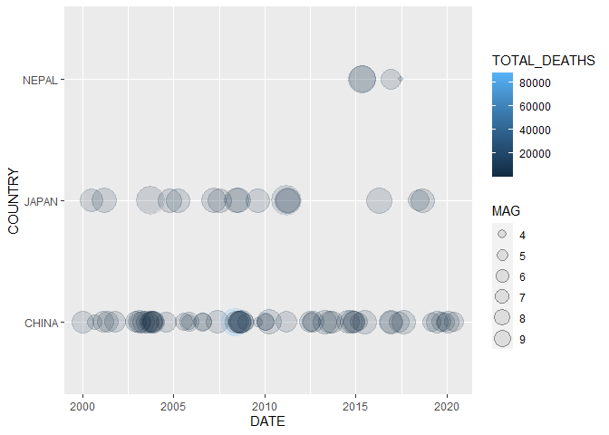
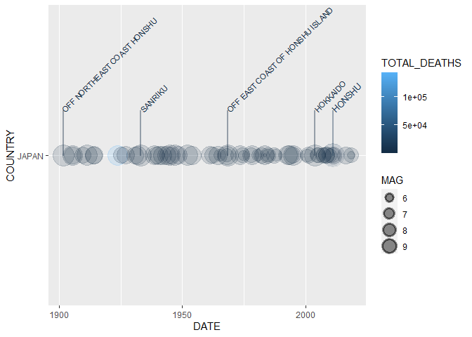
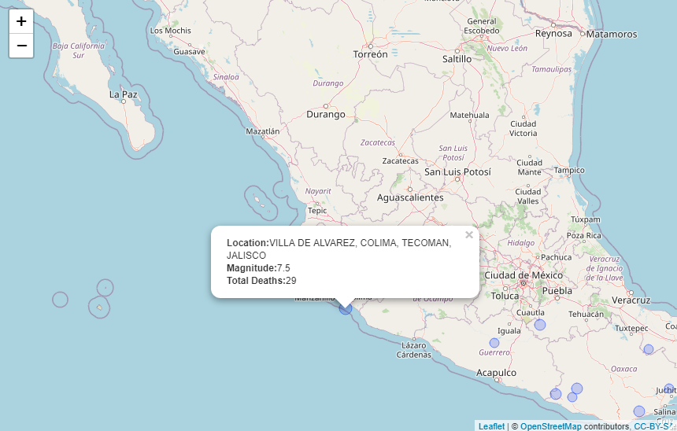

<!-- README.md is generated from README.Rmd. Please edit that file -->

# README

<!-- badges: start -->

[](https://travis-ci.com/rsizem2/noaa-earthquakes)
<!-- badges: end -->

This repository contains an R package for visualizing data from the
[NCEI/WDS Global Significant Earthquake
Database](https://www.ngdc.noaa.gov/hazel/view/hazards/earthquake/search).
The main functions it provides are for adding layers to ggplot where you
can make a timeline showing the significant earthquakes across a given
time period, and for generating leaflet maps showing the epicenters for
significant earthquake events.

# Installation

You can install this R package from GitHub using devtools:

``` r
library(devtools)
install_github("rizem2/noaa-earthquakes")
```

# Usage

Loading the relevant packages for these examples:

``` r
library(earthquakes)
library(tidyverse)
library(leaflet)
```

The functions provided with this package fall into 3 general categories:
reading/cleaning data, creating ggplot2 layers, and generating leaflet
maps.

## Reading/Cleaning Data

This package comes with the raw data file
`earthquakes-2021-03-08_17-02-58_-0500.tsv` taken directly from the NCEI
database API along with three functions for reading and cleaning the raw
data:

-   `eq_read_data` - reads a raw data file into a data frame and formats
    some of the columns. It takes a filepath as an argument indicating
    the raw data file to be read into R. If called with no arguments, it
    defaults to the supplied .tsv file.
-   `eq_location_clean` - splits the `LOCATION` column into a `COUNTRY`
    and `REGION` column. Takes a dataframe as an argument, presumably
    the output from `eq_read_data`. If called with no arguments, calls
    `eq_read_data`.
-   `eq_clean_data` - uses the raw `YEAR`,`MONTH`,`DAY` columns to form
    a `DATE` column using lubridate. Takes a dataframe as an argument,
    presumably the output from `eq_location_clean`. If called with no
    arguments, calls `eq_location_clean` and returns a fully “cleaned”
    dataframe of the supplied raw data.

Viewing the 10 most deadly earthquakes since the year 2000:

``` r
data <- eq_clean_data() %>% 
    dplyr::filter(!is.na(TOTAL_DEATHS)) %>% 
    dplyr::select(DATE, YEAR, COUNTRY, REGION, LONGITUDE, LATITUDE, MAG, TOTAL_DEATHS) %>%
  tidyr::drop_na()
data %>% 
  dplyr::filter(YEAR > 1999) %>%
  dplyr::arrange(desc(TOTAL_DEATHS)) %>%
                   head(n = 10)
#> # A tibble: 10 x 8
#>    DATE       YEAR  COUNTRY  REGION        LONGITUDE LATITUDE   MAG TOTAL_DEATHS
#>    <date>     <chr> <chr>    <chr>             <dbl>    <dbl> <dbl>        <dbl>
#>  1 2010-01-12 2010  HAITI    PORT-AU-PRIN~     -72.5   18.5     7         316000
#>  2 2004-12-26 2004  INDONES~ SUMATRA:  AC~      95.9    3.32    9.1       227899
#>  3 2008-05-12 2008  CHINA    SICHUAN PROV~     103.    31.0     7.9        87652
#>  4 2005-10-08 2005  PAKISTAN MUZAFFARABAD~      73.6   34.5     7.6        76213
#>  5 2003-12-26 2003  IRAN     SOUTHEASTERN~      58.3   29.0     6.6        31000
#>  6 2001-01-26 2001  INDIA    GUJARAT:  BH~      70.2   23.4     7.7        20005
#>  7 2011-03-11 2011  JAPAN    HONSHU            142.    38.3     9.1        18429
#>  8 2015-04-25 2015  NEPAL    KATHMANDU; I~      84.7   28.2     7.8         8200
#>  9 2006-05-26 2006  INDONES~ JAVA:  BANTU~     110.    -7.96    6.3         5749
#> 10 2018-09-28 2018  INDONES~ SULAWESI          120.    -0.178   7.5         4340
```

## Custom ggplot2 Layers

The next two functions are used to add custom layers to ggplot

### Timeline

This package comes with a custom ggplot2 Geom `GeomTimeline` for
visualizing Earthquake characteristics (such as Magnitude, Death Toll,
Damages, etc.) on a timeline. To use this Geom, add a ggplot2 layer
using the function `geom_timeline`.

Plot a timeline of deadly earthquakes in 3 different countries:

``` r
data %>% dplyr::filter(YEAR > 1999,
                       COUNTRY %in% c("JAPAN", "CHINA","NEPAL")) %>%
    ggplot2::ggplot() +
    geom_timeline(aes(x = DATE,
                      y = COUNTRY,
                      size = MAG,
                      color = TOTAL_DEATHS))
```



### Annotated Timeline

We can extend these visualizations even further by adding labels to our
timelines using the `GeomTimelineLabel` Geom. Simply add another ggplot2
layer using the `geom_timeline_label` in conjunction with
`geom_timeline`.

Labeling the 5 most deadly earthquakes (6 are shown since 5th is “tied”)
in the Japan since 1900, note that the column we use for labeling is
indicated by the `mag` aesthetic:

``` r
data %>% dplyr::filter(COUNTRY == "JAPAN", 
                              YEAR >= 1900) %>%
  ggplot2::ggplot(aes(x = DATE,
                      y = COUNTRY,
                      size = MAG,
                      color = TOTAL_DEATHS,
                      label = REGION,
                      mag = TOTAL_DEATHS)) +
  geom_timeline() +
  geom_timeline_label(aes(n_max = 5))
```



## Leaflet Maps

The final two functions generate leaflet maps for visualizing earthquake
epicenters on actual maps. The first function `eq_map` generates a
leaflet map from a dataframe with columns `LONGITUDE`, `LATITUDE`, and
`MAG`. `eq_map` takes one argument `annot_col` which denotes the column
of the dataframe to be used for annotation, by default uses `DATE`.

Plot the epicenters on a leaflet map:

``` r
data %>% 
  dplyr::filter(COUNTRY == "MEXICO", 
                YEAR >= 2000) %>% 
  eq_map(annot_col = "DATE")
```


The function `eq_create_label` generates labels from the input
dataframe. We can use `eq_create_label` within `dplyr::mutate` to modify
the input dataframe by creating a column to store the desired pop-up
text as an HTML string. The generated pop-ups will display the location,
magnitude and total death count (if available) for any given earthquake.

``` r
data %>% 
  dplyr::filter(COUNTRY == "MEXICO",
                YEAR >= 2000) %>% 
  dplyr::mutate(popup_text = eq_create_label(.)) %>% 
  eq_map(annot_col = "popup_text")
```


