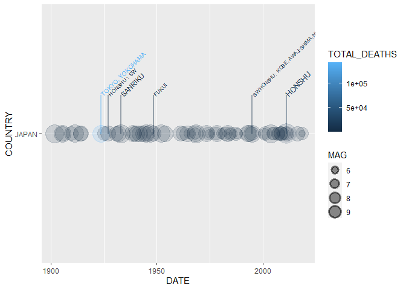

<!-- README.md is generated from README.Rmd. Please edit that file -->

# README

<!-- badges: start -->

[](https://travis-ci.com/rsizem2/noaa-earthquakes)
<!-- badges: end -->

This repository contains an R package for working with data from the
[NCEI/WDS Global Significant Earthquake
Database](https://www.ngdc.noaa.gov/hazel/view/hazards/earthquake/search).
This package is a work in progress and not ready for use at the moment.

# Installation

``` r
library(devtools)
install_github("rizem2/noaa-earthquakes")
```

# Examples

Loading the relevant packages for these examples:

``` r
library(earthquakes)
library(tidyverse)
library(leaflet)
```

## Reading Data

View the 10 most deadly earthquakes after the year 2000:

``` r
data <- eq_clean_data() %>% 
    dplyr::filter(!is.na(TOTAL_DEATHS)) %>% 
    dplyr::select(DATE, YEAR, COUNTRY, REGION, LONGITUDE, LATITUDE, MAG, TOTAL_DEATHS) %>%
  tidyr::drop_na()
data %>% 
  dplyr::filter(YEAR > 1999) %>%
  dplyr::arrange(desc(TOTAL_DEATHS)) %>%
                   head(n = 10)
#> # A tibble: 10 x 8
#>    DATE       YEAR  COUNTRY  REGION        LONGITUDE LATITUDE   MAG TOTAL_DEATHS
#>    <date>     <chr> <chr>    <chr>             <dbl>    <dbl> <dbl>        <dbl>
#>  1 2010-01-12 2010  HAITI    PORT-AU-PRIN~     -72.5   18.5     7         316000
#>  2 2004-12-26 2004  INDONES~ SUMATRA:  AC~      95.9    3.32    9.1       227899
#>  3 2008-05-12 2008  CHINA    SICHUAN PROV~     103.    31.0     7.9        87652
#>  4 2005-10-08 2005  PAKISTAN MUZAFFARABAD~      73.6   34.5     7.6        76213
#>  5 2003-12-26 2003  IRAN     SOUTHEASTERN~      58.3   29.0     6.6        31000
#>  6 2001-01-26 2001  INDIA    GUJARAT:  BH~      70.2   23.4     7.7        20005
#>  7 2011-03-11 2011  JAPAN    HONSHU            142.    38.3     9.1        18429
#>  8 2015-04-25 2015  NEPAL    KATHMANDU; I~      84.7   28.2     7.8         8200
#>  9 2006-05-26 2006  INDONES~ JAVA:  BANTU~     110.    -7.96    6.3         5749
#> 10 2018-09-28 2018  INDONES~ SULAWESI          120.    -0.178   7.5         4340
```

## Timeline Geom

Plot a timeline of deadly earthquakes in 3 different countries:

``` r
data %>% dplyr::filter(YEAR > 1999,
                       COUNTRY %in% c("JAPAN", "CHINA","NEPAL")) %>%
    ggplot2::ggplot() +
    geom_timeline(aes(x = DATE,
                      y = COUNTRY,
                      size = MAG,
                      color = TOTAL_DEATHS))
```


## Annotated Timeline

Label the 5 most deadly earthquakes in the Japan since 1900:

``` r
data %>% dplyr::filter(COUNTRY == "JAPAN", 
                              YEAR >= 1900) %>%
  ggplot2::ggplot(aes(x = DATE,
                      y = COUNTRY,
                      size = MAG,
                      color = TOTAL_DEATHS,
                      label = REGION,
                      mag = MAG)) +
  geom_timeline() +
  geom_timeline_label(aes(n_max = 5))
```



## Basic Leaflet Map

Plot the epicenters on a leaflet map:

``` r
data %>% 
  dplyr::filter(COUNTRY == "MEXICO", 
                YEAR >= 2000) %>% 
  eq_map(annot_col = "DATE")
```


## Fancier Labels

Leaflet maps with more information included in the popups:

``` r
data %>% 
  dplyr::filter(COUNTRY == "MEXICO",
                YEAR >= 2000) %>% 
  dplyr::mutate(popup_text = eq_create_label(.)) %>% 
  eq_map(annot_col = "popup_text")
```


